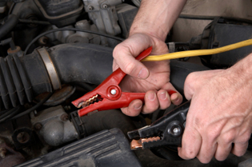

    

    <h1>Services</h1>
    
We come to you by appointment - quick, qualified &amp; convenient. An estimate for the repair will always be provided before work begins. Our experienced service will get your vehicle running and back in good condition.

    
You may provide the part needed or we can provide and install any part for you. I will come to you for minor repairs or diagnostics. Also a repair facility is availiable for major repairs. A towing service is availiable for these in-shop repairs.

	
We offer online invoicing using PayPal, and will accept any major Visa, Mastercard, debit, or credit cards. Our mininum service call is {{ page.minimumServiceCost }}.

    
Although our main service is on-site at your location, we offer a full-repair shop facility, located in Belvedere, SC, with available towing service &amp; rental vehicle assistance.

    
Some of the services we provide are:

    <ul class="services">
    	<li>Air Conditioning System Service</li>
        <li>Battery Maintenace and Factory-Scheduled Maintenance</li>
        <li>Belt &amp; Hose Replacement</li>
        <li>Brake Repair and Brake Fluid Flush</li>
        <li>Clean &amp; Replacement of Fuel Injectors</li>
        <li>Cooling System Flush and Service</li>
        <li>Diagnostics and On-board OBD scanning</li>
        <li>Disc &amp; Drum Brake Service</li>
        <li>Drive &amp; Timing Belts</li>
        <li>Drive Train</li>
        
    </ul>
    <ul class="services">
        <li>Engine and Transmission Fluid Replacement</li>
        <li>Electrical Circuit Specialist and Wiring Repairs</li>
        <li>Fuel Systems</li>
        <li>Maintenance</li>
        <li>Radiator and Heater Hoses</li>
        <li>Testing and Service</li>
        <li>Tire Rotation</li>
        <li>Tune-Up</li>
        <li>Window Motors and regulators</li>
        <li>Many other services</li>
    </ul>

